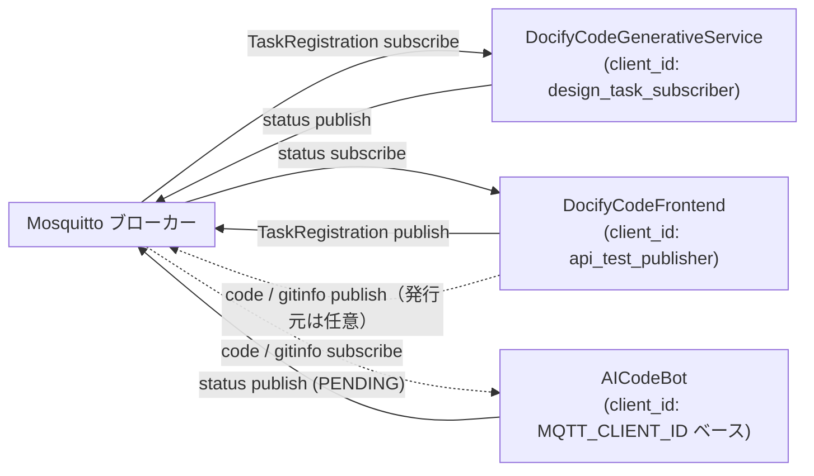
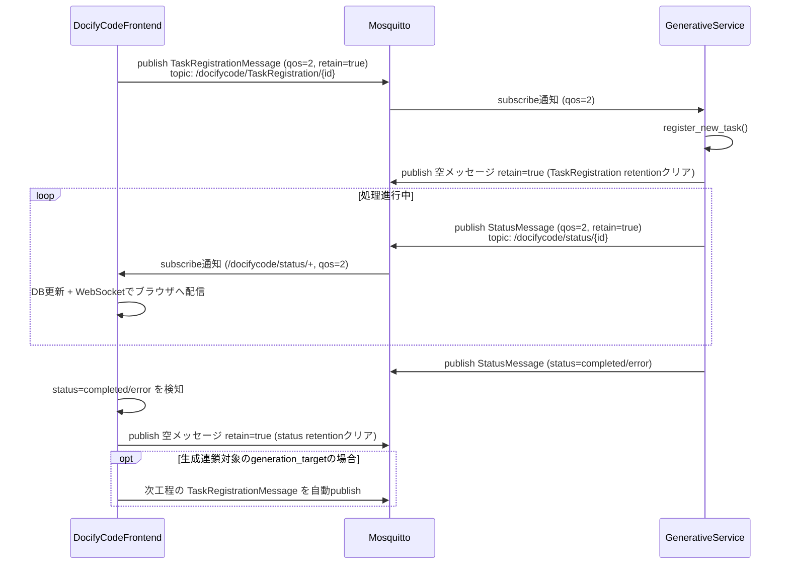
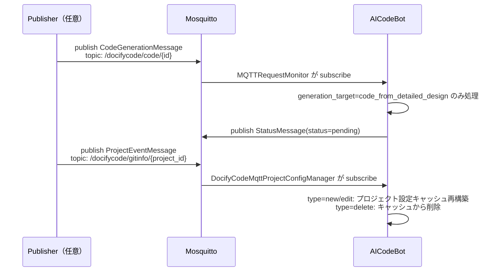

# DocifyCode MQTT連携 仕様書

- 作成日: 2026-09-01
- 対象リポジトリ: `DocifyCodeFrontend`, `DocifyCodeGenerativeService`, `AICodeBot`
- 本書の位置づけ: 現行実装（`cec_docifycode_common/mqtt/`, `app/api/mqtt/`, `app/services/mqtt_service.py` ほか）を調査し、実装内容をそのまま仕様として文書化したもの。設計意図が不明瞭な箇所・実装とドキュメントに乖離がある箇所は「11. 既知の課題」に明記する。

---

## 1. 概要

DocifyCodeは、以下3コンポーネント間の非同期タスク連携基盤として **MQTT（Eclipse Mosquitto）** を利用している。

| コンポーネント | 役割 | 主な実装箇所 |
|---|---|---|
| DocifyCodeFrontend | ユーザー操作からタスク登録メッセージを発行し、進捗ステータスを受信してDB更新・WebSocket配信を行う | `app/api/mqtt/mqtt.py`, `app/services/mqtt_service.py` |
| DocifyCodeGenerativeService | タスク登録を受信してAIによる各種生成処理を実行し、進捗ステータスをpublishする | `core/mqtt/mqtt_service.py`, `core/mqtt/mqtt_message_queue.py` |
| AICodeBot | Gitリポジトリ連携によるコード生成・プロジェクト設定同期を担当する別系統のエージェント | `core_tasks/activity_monitoring/mqtt_request_monitor.py`, `docifycode/docifycode_mqtt_project_config_manager.py`, `docifycode/generative_service_execution_promise.py` |

3リポジトリはいずれも共通ライブラリ `cec_docifycode_common`（MQTTクライアント・トピック定義・メッセージスキーマ）を内包しており、内容はほぼ同一だが**リポジトリごとに個別コピーされ独立して存在する**（詳細は「11. 既知の課題」）。

### 1.1 全体構成図



---

## 2. ブローカー構成

- **ブローカー**: Eclipse Mosquitto（Dockerイメージ `eclipse-mosquitto:2.0`）
- **カスタムイメージ**: `docifycode/mqtt:1.0.0`（レジストリ: `techtools.cec-ltd.co.jp:5050/docker-container/docifycode/mqtt:1.0.0`）
- **ビルド方式**: `DocifyCodeFrontend/Middleware/mqtt/build.sh` が `docker-compose.template` を `sed` 置換し、環境別のcompose定義を生成する

| 環境 | コンテナ名 | MQTTポート | WebSocketポート |
|---|---|---|---|
| ローカル | `local_mqtt` | 1883:1883 | 9001:9001 |
| Azure/本番系 | `azure_mqtt` | 11883:1883 | 19001:9001 |

- 起動: `DocifyCodeFrontend/Middleware/start_azure_mqtt.sh`（`docker-compose -f mqtt/azure_mqtt.yml up -d`）
- `DocifyCodeExecutionEnvironment/{azure,local}/docker-compose.yml` にも同様のサービス定義があり、外部ネットワーク `docifycode_network`（`external: true`）に接続
- データ永続化: `./mqtt/data:/mosquitto/data`、ログ: `./mqtt/log:/mosquitto/log`
- ログドライバ: `json-file`（max-size 10m, max-file 5）、`restart: always`

### 2.1 mosquitto.conf

```conf
listener 1883
allow_anonymous true
persistence true
persistence_location /mosquitto/data/
log_dest stdout
log_type error
log_type warning
log_type notice
log_type information

listener 9001
protocol websockets

max_connections -1
```

- 認証ファイル（`password_file`）・ACLファイル（`acl_file`）・TLS設定（`cafile`/`certfile`等）は**一切未設定**。詳細は「10. セキュリティ」参照。

---

## 3. 接続仕様

### 3.1 接続パラメータ

| 項目 | 値 |
|---|---|
| ホスト | 環境変数 `MQTT_BROKER_HOST`（下表参照） |
| ポート | 環境変数 `MQTT_BROKER_PORT`（既定 1883、Azure実運用は 11883） |
| Keepalive | 60秒固定（`MQTT_KEEPALIVE`） |
| 既定QoS | 2（`MQTT_QOS`） |
| 認証 | `MQTT_USERNAME` / `MQTT_PASSWORD`（全環境で空欄＝匿名接続） |
| プロトコル | MQTT 3.1.1相当（paho-mqtt既定） / WebSocket（9001番） |

### 3.2 クライアントID

| コンポーネント | クライアントID | 備考 |
|---|---|---|
| DocifyCodeFrontend | `"api_test_publisher"`（固定文字列） | publish/subscribe兼用の単一クライアント |
| DocifyCodeGenerativeService | `"design_task_subscriber"`（固定文字列） | |
| AICodeBot（プロジェクト設定同期） | `MQTT_CLIENT_ID`（既定 `ai_programming_service_client`） | |
| AICodeBot（コード生成リクエスト監視） | `MQTT_CLIENT_ID + "_request_monitor"` | |
| AICodeBot（タスク実行Promise） | `MQTT_CLIENT_ID` | |

`DocifyCodeMqttClient` はクライアントID単位のシングルトンとして管理されており（`__named_clients: dict[str, MQTTClient]`）、同一client_idで複数回インスタンス化しても内部の`MQTTClient`は共有される。

### 3.3 セッション

- `DocifyCodeFrontend`の`MQTTService`は **`clean_session=False`**（永続セッション）を明示的に使用し、オフライン中のメッセージ取りこぼしを防ぐ
- 他コンポーネントは`MQTTClient`の既定値 `clean_session=True` を使用

---

## 4. トピック仕様

トピック定義は `cec_docifycode_common/mqtt/topics.py` の `DocifyCodeMqttTopic` Enumに集約されている。

```python
class DocifyCodeMqttTopic(Enum):
    STATUS = "/docifycode/status/{process_history_id}"
    TASK_REGISTRATION = "/docifycode/TaskRegistration/{process_history_id}"
    TASK_MANAGEMENT = "/docifycode/TaskManagement/{process_history_id}"
    CODE_GENERATION = "/docifycode/code/{process_history_id}"
    PROJECT_INFO = "/docifycode/gitinfo/{project_id}"
```

| トピックパターン | 用途 | メッセージ型 | 状態 |
|---|---|---|---|
| `/docifycode/status/{process_history_id}` | タスク処理ステータス通知 | `StatusMessage` | 使用中 |
| `/docifycode/TaskRegistration/{process_history_id}` | 新規タスク登録依頼 | `TaskRegistrationMessage` | 使用中 |
| `/docifycode/TaskManagement/{process_history_id}` | （用途未実装） | なし | **Enum定義のみ、pub/sub実装なし** |
| `/docifycode/code/{process_history_id}` | コード生成リクエスト（AICodeBot向け） | `CodeGenerationMessage` | 使用中 |
| `/docifycode/gitinfo/{project_id}` | プロジェクト作成/編集/削除イベント通知 | `ProjectEventMessage` | 使用中 |

### 4.1 ワイルドカード購読

`subscribe_to_topic()` はメッセージID未指定時、プレースホルダを単一階層ワイルドカード `+` に置換して購読する（例: `/docifycode/status/+`）。トピック文字列からのEnum判定・プレースホルダ抽出は `_MQTTTopicHandler`（正規表現＋fnmatch）が行い、複数パターンに一致した場合は例外を送出する。

---

## 5. メッセージスキーマ

全メッセージは Pydantic の `MQTTMessage`（`schemas/mqtt_message.py`, `extra="forbid"`）を基底クラスとし、`json.dumps(model.model_dump(mode="json", exclude_none=True))` でJSON文字列化してpublishされる。

### 5.1 StatusMessage — `/docifycode/status/{process_history_id}`

```json
{
  "process_history_id": "string (必須)",
  "project_id": "string (必須)",
  "status": "pending | generating | completed | error | canceled (必須)"
}
```

`TaskExecutionStatus`: `PENDING="pending"`, `GENERATING="generating"`, `COMPLETED="completed"`, `ERROR="error"`, `CANCELED="canceled"`

### 5.2 TaskRegistrationMessage — `/docifycode/TaskRegistration/{process_history_id}`

```json
{
  "process_history_id": "string (必須)",
  "project_id": "string (必須)",
  "generation_target": "string enum (必須、5.2.1参照)",
  "task_options": { "任意のキー": "任意の値" },
  "revision_number": "string (任意, 対象コミットID)",
  "user_name": "string (任意, Gitユーザー名)",
  "token_password": "string (任意, 暗号化済み Gitトークン/パスワード)"
}
```

- `token_password` は受信時に自動復号（`field_validator`）、publish時に自動暗号化（`field_serializer`）される。暗号化方式は AES-256-GCM（`utils/encryption.py`、ノンス12byte + 暗号文をbase64化、鍵は環境変数`ENCRYPTION_KEY`）。

#### 5.2.1 generation_target（`GenerationTarget`）一覧

| 値 | 意味 |
|---|---|
| `basic_design_fe` | 要件定義 → 基本設計 |
| `detail_design_fe` | 基本設計 → 詳細設計 |
| `basic_design_re` | 詳細設計 → 基本設計（逆生成） |
| `source_code_fe` | 詳細設計 → ソースコード |
| `detail_design_to_utd_utc_fe` | 詳細設計 → UTD/UTC |
| `detail_design_utd_to_utc_fe` | 詳細設計UTD → UTC |
| `source_code_to_utd_utc_fe` | ソースコード → UTD/UTC |
| `detail_design_re` | ソースコード → 詳細設計（逆生成） |
| `utc_fe` | UTD → UTC |
| `summary` | ソースコード → サマリ |
| `single_file_summary` | 単一ファイル → サマリ |
| `standalone_generation` | 単独生成 |
| `single_file_summary_pu` | 単一ファイル → サマリ（PlantUML） |

### 5.3 CodeGenerationMessage — `/docifycode/code/{process_history_id}`

```json
{
  "process_history_id": "string (必須)",
  "project_id": "string (必須)",
  "generation_target": "code_from_detailed_design (必須)",
  "target_branch": "string | null",
  "target_language": "Python | Java | Csharp (必須)"
}
```

### 5.4 ProjectEventMessage — `/docifycode/gitinfo/{project_id}`

```json
{
  "type": "new | edit | delete (必須)",
  "project_id": "string (必須)"
}
```

### 5.5 トピック⇔メッセージ型マッピング

```python
_MESSAGE_MODEL_MAPPING = {
    DocifyCodeMqttTopic.PROJECT_INFO: ProjectEventMessage,
    DocifyCodeMqttTopic.STATUS: StatusMessage,
    DocifyCodeMqttTopic.TASK_REGISTRATION: TaskRegistrationMessage,
    DocifyCodeMqttTopic.CODE_GENERATION: CodeGenerationMessage,
}
```

`publish_message()` はpublishするメッセージの型を`isinstance`判定し、対応トピックと`message_id`（`process_history_id`または`project_id`）を自動決定する。`TASK_MANAGEMENT`に対応するスキーマは存在しない（未実装）。

---

## 6. QoS / Retain 仕様

### 6.1 QoS

- 既定QoSは全コンポーネントで **2（Exactly-once）**
- 明示的にQoS 2を指定している主な箇所:
  - `TaskRegistrationMessage` publish（`app/api/mqtt/mqtt.py`）
  - `StatusMessage` publish/subscribe（Frontend・GenerativeService双方）
  - `TASK_REGISTRATION` subscribe（GenerativeService）
  - `clear_retention()` 内部の空メッセージpublish
- QoS 0/1を明示利用している箇所はなし。Mosquitto側で`persistence true`が有効なため、ブローカー再起動時の再配送信頼性をQoS2で担保する設計と考えられる。

### 6.2 Retain

- `StatusMessage` と `TaskRegistrationMessage` は `retain=True` でpublishされ、後からsubscribeしたクライアントが最新状態を取得できるようにしている
- タスクが `COMPLETED` または `ERROR` になった時点で、`clear_retention()`（空ペイロード + `retain=True`）により該当トピックの保持メッセージを明示的に削除する
  - Frontend: `_finalize_project_status()` → `_clear_mqtt_retention()`
  - GenerativeService: `acknowledge_task_registered()` が `TASK_REGISTRATION` の retention をクリア

---

## 7. 処理フロー

### 7.1 タスク登録〜完了（Frontend ⇔ GenerativeService、メインフロー）



### 7.2 AICodeBot経由のフロー（別系統）



---

## 8. 環境変数一覧

| 変数名 | 説明 | 既定値 (Frontend) | 既定値 (AICodeBot) | 既定値 (GenerativeService) |
|---|---|---|---|---|
| `MQTT_BROKER_HOST` | ブローカーホスト | `localhost`（実運用`.env`: `54-PC0244-8.cec-ltd.co.jp`） | `mqtt_broker` | `mqtt_broker` |
| `MQTT_BROKER_PORT` | ブローカーポート | `1883`（実運用: `11883`） | `1883` | `1883` |
| `MQTT_WEBSOCKET_PORT` | WebSocketポート | `9001`（実運用: `19001`） | 未定義 | 未定義 |
| `MQTT_KEEPALIVE` | Keepalive秒 | `60` | `60` | `60` |
| `MQTT_QOS` | 既定QoS | `2` | `2` | `2` |
| `MQTT_USERNAME` | 認証ユーザー名 | 空 | 空 | 空 |
| `MQTT_PASSWORD` | 認証パスワード | 空 | 空 | 空 |
| `MQTT_CLIENT_ID` | クライアントID | 未使用（コード固定値） | `ai_programming_service_client` | 未使用（コード固定値） |
| `ENCRYPTION_KEY` | Git認証情報暗号化鍵（AES-256-GCM, base64 32byte） | 共通ライブラリ経由で参照 | 同左 | 同左 |

---

## 9. エラーハンドリング・再接続処理

### 9.1 MQTTClient（paho-mqtt ラッパー）レイヤー

- `reconnect_delay_set(min_delay=1, max_delay=reconnect_delay_max)` により自動再接続を有効化
- 接続成功コールバック(`_on_connect`)で rc≠0 の場合はエラーコードをマッピングしてログ出力（1=プロトコルバージョン不正, 2=クライアントID不正, 3=サーバー利用不可, 4=ユーザー名/パスワード不正, 5=認可なし）
- 再接続成功時、それまで購読していたトピック一覧に**自動再subscribe**
- 異常切断時(`_on_disconnect`)はWARNログを出力し、`auto_reconnect`有効なら自動再接続する
- `sync_connect()`/`connect()`は指数バックオフ（`min(2**(attempt-1), 60)`秒）で最大`max_attempts`回（既定10、0で無限）リトライ

### 9.2 アプリケーション層

- **Frontend**: `MQTTService._monitor_and_reconnect_mqtt()` が起動2秒後に初回接続、以後15秒間隔で接続状態を監視。切断検知時はpaho-mqttループスレッドの生存確認→最大15秒待機→ダメなら手動`connect()`再試行。`graceful_shutdown()`では`clean_session=False`のまま切断し永続セッションを維持
- **GenerativeService**: `_subscribe_mqtt_topics_background()` が15秒間隔で接続確認・subscribeをリトライ。再接続検知時は`MQTTMessageQueue.flush_queue()`でオフライン中にキューイングされた`StatusMessage`/`clear_retention`操作を一括再送
- **AICodeBot**: メインループ（10秒間隔）で`mqtt_client.is_connected`を監視し、非活性検知時は`restart()`（切断→再生成→再接続→再subscribe）

### 9.3 メッセージ処理時の例外処理

- JSONデコードエラー・Pydanticバリデーションエラー・その他例外を個別にcatchし、ログ出力および例外ログのDB保存を実施
- ステータス更新処理で例外が発生した場合、プロジェクトステータスを`error`にフォールバックする
- 空ペイロード（retentionクリア用の空メッセージ）受信時はコールバックを実行せずreturnするガードあり

---

## 10. セキュリティ

現状の実装は **認証・認可・暗号化のいずれも欠如した「信頼済み内部ネットワーク前提」の設計** である。

| 項目 | 現状 |
|---|---|
| ユーザー認証 | `allow_anonymous true`。`MQTT_USERNAME`/`MQTT_PASSWORD`の仕組み自体はコード上存在するが全環境で空欄運用 |
| ACL（トピック単位のアクセス制御） | 未設定。全クライアントが全トピックに対しpublish/subscribe可能 |
| 通信暗号化（TLS） | 未設定。1883/9001番いずれも平文接続 |
| メッセージ本文の暗号化 | `TaskRegistrationMessage.token_password`（Gitトークン/パスワード）のみAES-256-GCMで暗号化。鍵`ENCRYPTION_KEY`未設定時はコード中のデフォルト鍵にフォールバックする点は要改善 |
| ネットワーク分離 | Docker外部ネットワーク`docifycode_network`内に閉じる設計だが、Frontend実運用`.env`は特定ホスト名+転送ポート（11883）を直接指定し社内ネットワーク経由でアクセス |

---

## 11. 既知の課題・今後の検討事項

1. **共通ライブラリの三重管理**: `cec_docifycode_common`（mqtt/schemas含む）が3リポジトリに個別コピーされている。仕様変更時は3箇所の整合性確認が必要。
2. **`schemas/base.py` と `schemas/mqtt_message.py` に同名 `MQTTMessage` クラスが重複定義**（前者は空定義、実際に使用されるのは後者）。整理対象。
3. **`TASK_MANAGEMENT`トピックはEnum定義のみで実装なし**（未使用または将来拡張用）。
4. **`DocifyCodeGenerativeService/config/mqtt_topics.py` の `MQTT_SUBSCRIPTIONS` 辞書は実際のsubscribe処理から参照されていない**（形骸化した設定）。実運用のトピック/QoS決定は`cec_docifycode_common`側の`DocifyCodeMqttClient`に一本化されている。
5. **MQTT_SETUP.md記載のFastAPI用MQTT REST APIは現状のディレクトリ構成には存在せず**、ドキュメントと実装に乖離がある。
6. 認証・ACL・TLSが未設定のため、社内ネットワーク外からのアクセスや将来のマルチテナント化を見据える場合はセキュリティ強化が必要。

---

## 12. 参考: 主要ソースファイル一覧

| ファイル | 内容 |
|---|---|
| `cec_docifycode_common/mqtt/mqtt_client.py` | paho-mqttラッパー（`MQTTClient`）。接続・再接続・publish/subscribe・retentionクリア |
| `cec_docifycode_common/mqtt/docify_code_mqtt_client.py` | トピック⇔メッセージ型マッピング、シングルトン管理、`_MQTTTopicHandler` |
| `cec_docifycode_common/mqtt/topics.py` | `DocifyCodeMqttTopic` Enum |
| `cec_docifycode_common/mqtt/config/mosquitto.conf` | ブローカー設定 |
| `cec_docifycode_common/schemas/mqtt_message.py` | メッセージ基底クラス |
| `cec_docifycode_common/schemas/status_schema.py` | `StatusMessage` |
| `cec_docifycode_common/schemas/task_registration_schema.py` | `TaskRegistrationMessage`、認証情報の暗号化/復号 |
| `cec_docifycode_common/schemas/project_event_schema.py` | `ProjectEventMessage` |
| `DocifyCodeFrontend/app/api/mqtt/mqtt.py` | Frontend側のpublish/subscribeロジック、ステータス処理 |
| `DocifyCodeFrontend/app/services/mqtt_service.py` | 接続監視・再接続ループ |
| `DocifyCodeGenerativeService/core/mqtt/mqtt_service.py` | GenerativeService側のsubscribe/publishロジック |
| `DocifyCodeGenerativeService/core/mqtt/mqtt_message_queue.py` | オフライン時のメッセージキュー |
| `AICodeBot/core_tasks/activity_monitoring/mqtt_request_monitor.py` | コード生成リクエスト監視 |
| `AICodeBot/docifycode/docifycode_mqtt_project_config_manager.py` | プロジェクト設定同期 |
| `DocifyCodeFrontend/Middleware/mqtt/`, `Middleware/start_azure_mqtt.sh` | ブローカーのビルド・デプロイ |
